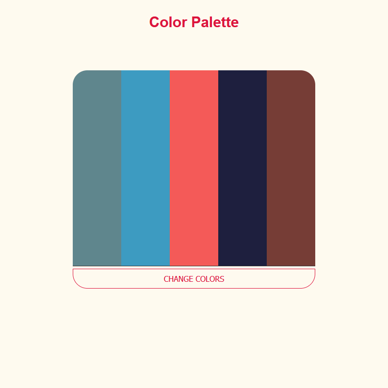

# Color-Palette

Very interesting <a href="https://ivanmpr.github.io/Color-Palette/">project</a> for me. I found inspiration <a href="https://coolors.co/palettes/trending" target="_blank">here</a>,
and decided to make something similar. Click on the main button will randomly change color in every field. Hovering the field,
makes it larger and reveals field background color code, which can be copied.

HTML, CSS, JS
